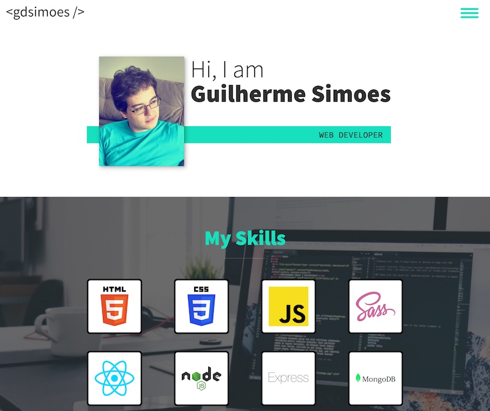

# Portfolio Website

This is my portfolio website.

## Table of contents

-   [Overview](#overview)
    -   [Description](#description)
    -   [Screenshot](#screenshot)
    -   [Links](#links)
-   [My process](#my-process)
    -   [Built with](#built-with)
    -   [What I learned](#what-i-learned)
    -   [Useful resources](#useful-resources)
-   [Author](#author)

## Overview

### Description

I created this website using HTML, CSS (with Sass), and vanilla JavaScript. It is hosted on a Digital Ocean Droplet running Ubuntu 22.04 LTS. I used Nginx as my server and have enabled HTTPS and HTTP/2.

### Screenshot

### Links

-   Solution URL: <https://github.com/gdsimoes/portfolio-website>
-   Live Site URL: <https://www.gdsimoes.com/>

## My process

### Built with

-   Linux
-   Nginx
-   Sass (SCSS)
-   BEM Methodology
-   CSS Grid
-   JavaScript
-   Font Awesome

### What I learned

All the languages and technologies used in this project were familiar to me, but there were challenges and opportunities to learn. Setting up a server requires a lot of knowledge, and to make it secure, I had to pay a lot of attention to the details. I also got to practice using CSS Grid and learned a nice trick to limit the number of columns in a grid. I also used the BEM methodology for the first time, where the Sass Parent Selector streamlined the code significantly.

### Useful resources

-   [Sass - Parent Selector](https://sass-lang.com/documentation/style-rules/parent-selector) - The official Sass documentation is well-written and thorough, so I didn't have to look elsewhere to learn how to use the parent selector.
-   [FrontendMasters - Full Stack for Front-End Engineers, v2](https://frontendmasters.com/courses/fullstack-v2/) - This course by Jem Young taught a lot about the specifics necessary to run a server. The sections on HTTPS and HTTP/2 were particularly insightful.
-   [explainshell.com](https://explainshell.com/) - This is a handy website for checking what specific shell commands do.
-   [Stack Overflow - Maximum number of columns without media queries](https://stackoverflow.com/questions/55281598/css-grid-maximum-number-of-columns-without-media-queries) - This is a nice trick that simplified the code since I avoided using media queries to limit the number of columns.

## Author

-   Website - <https://gdsimoes.com>
-   LinkedIn - [Guilherme Dias Simoes](https://www.linkedin.com/in/gdsimoes)
